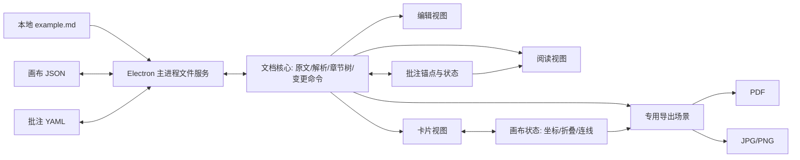

# MerMarkd 产品设计与技术架构（v0.3）

> 2026-09-17。本文是新项目的实施蓝图。默认首发 Windows 桌面版、单个本地 Markdown 文件、离线工作；macOS/Linux 作为后续平台。估期按一名熟练的全栈开发者计算。开发门槛与未验证约束见[可行性审查](FEASIBILITY_REVIEW.md)，实施规则见[开发流程](DEVELOPMENT_PROCESS.md)。

## 1. 产品定位

MerMarkd 是**以标准 Markdown 文件为内容来源的桌面阅读、批注与结构整理工具**。它让用户在源码编辑、排版阅读、章节卡片画布之间切换；阅读时用高亮、便签批注和标签整理想法，画布中用卡片呈现标题层级，用箭头表达章节之间的额外关系。

主要用户是写长文档的人：知识笔记作者、技术文档维护者、课程资料整理者和研究资料阅读者。典型场景是打开已有 `.md`，阅读内容，切到卡片画布观察章节结构、整理关系，必要时把一个完整章节改为另一个章节的子章节，再导出画布用于分享或打印。

产品的核心价值是**从已有 Markdown 中形成可追溯的阅读产出，并可视化整理章节**，同时保持 `.md` 本身可以被普通编辑器独立使用。首版不做云同步、团队协作、跨文件知识图谱、富文本卡片编辑或 AI 生成。

## 2. 核心原则与文件变更边界

1. **Markdown 是正文与章节结构的唯一来源。** 每张章节卡片从 Markdown 标题树派生，不在侧边文件复制正文。
2. **结构与关系分开。** 标题层级决定父子卡片；用户画的箭头是额外关系，不修改标题或正文。
3. **普通画布操作不改 `.md`。** 移动坐标、缩放、展开/收起、调整连线和导出只写画布元数据或输出文件。
4. **只有明确改变卡片容纳关系才改 Markdown 结构。** 把章节放入另一卡片或明确移出为更高层级时，移动整个章节子树，并重算被移动子树的标题级别；正文字符、代码、图片路径等保持原样。编辑模式中的直接输入当然也会修改 `.md`。对无法证明语义安全的移动，应用阻止操作。
5. **操作可预测、可撤销。** 结构拖入需要清晰的投放区域和变更预览；在保存前可撤销/重做。不能因普通卡片重叠就触发结构调整。
6. **本地优先与无损。** 不依赖云服务，保留换行风格和文件编码信息；外部修改与应用内未保存内容冲突时不静默覆盖。
7. **导出是内容，不是屏幕截图。** 默认使用卡片画布完整边界，不裁掉当前视口外的卡片或箭头。
8. **阅读标记不污染原文。** 高亮、批注正文和标签均不写入 `.md`；批注写入同目录的 `.annotations.yaml` 后缀文件。选区锚定原文内容，不依赖页面像素坐标。
9. **内容优先。** 高亮仅用克制的背景色，批注主要进入边栏；表格、列表使用语义布局，不为了“对齐”自动增删 Markdown 空格或改写中英文字符。

| 用户操作 | `.md` 文件 | 批注 YAML | 画布 JSON |
| --- | --- | --- | --- |
| 编辑模式输入、粘贴、保存 | 修改 | 可能需要重定位锚点 | 章节标识可能需要重新匹配 |
| 阅读、查找、模式切换 | 不修改 | 不必修改 | 可更新上次视口等偏好 |
| 新增、改色、删除高亮；新增、编辑、删除批注和标签 | 不修改 | 修改 | 不修改 |
| 卡片自由拖动、缩放、展开/收起；新增或编辑箭头 | 不修改 | 不修改 | 修改 |
| 导出 PDF/JPG/PNG 或批注摘要 | 不修改 | 不必修改 | 不必修改 |
| 把章节卡片放入另一张卡片的“子章节”区域 | 移动该章节及后代，调整其标题层级 | 校验并重定位受影响锚点 | 更新卡片父级与布局 |
| 明确选择“提升一级/移至顶层” | 移动该章节及后代，预览并调整标题层级 | 校验并重定位受影响锚点 | 更新卡片父级与布局 |

## 3. 章节与卡片的语义

每个标题产生一张章节卡片。卡片的“本节正文”是标题后、下一个标题前的直接内容；后续比它深的标题形成子卡片。父卡片逻辑上涵盖所有后代，但界面不重复拷贝后代正文。

例如：

```md
# A
A 的正文
## B
B 的正文
### C
C 的正文
# D
D 的正文
```

画布中 `A` 包含 `B`，`B` 包含 `C`；`D` 与 `A` 并列。把 `B` 拖入 `D` 的“作为子章节”区域后，Markdown 变为：

```md
# A
A 的正文
# D
D 的正文
## B
B 的正文
### C
C 的正文
```

具体规则：

- 标题深度为 1–6。多个一级标题并列；若文件从二级或三级标题开始，该标题仍是顶层卡片，保留原始级别。
- 标题跳级时，子卡片归属最近的较浅标题，例如 `# A` 后的 `### C` 属于 `A`；阅读和普通画布操作不“修正”它。
- 第一个标题之前的正文显示在虚拟“文档前言”卡片中；完全没有标题时显示一个虚拟“全文”卡片。这两类卡片不可作为真实标题的拖入目标。
- 识别标题必须使用 Markdown 解析器，代码围栏、代码缩进块中的 `#` 不能产生卡片。首版只有文档根层的标题形成可移动章节卡片；引用块、列表等容器内部的标题属于所在正文，不被提升为全局章节，以免移动原文块破坏容器语法。首版支持 CommonMark 标题、GFM 内容和 YAML frontmatter；frontmatter 不形成卡片。Setext 标题可阅读、可卡片化。结构变更需要把单行 Setext 改成 ATX 时，必须预览完整源码差异并重新解析；多行 Setext 如需转换，首版阻止该结构操作并引导在编辑模式调整。
- 卡片显示标题、本节正文摘要、直接子章节数量和连线提示。卡片正文可独立“展开全文”，避免一篇长文把画布撑到无法使用。
- “展开卡片”显示其直接子卡片；“收起卡片”隐藏其所有后代；“全部展开/全部收起”作用于整份文档。收起时仍显示隐藏章节数量和涉及隐藏节点的连线数量。
- 用户连线可跨层级、跨分支，允许环；它不改变父子树。自动生成的层级关系与用户连线在视觉和数据模型中区分。

### 结构拖入的精确规则

用户先拖动卡片。普通画布松手只改变坐标。拖到目标卡片出现的“设为子章节”投放区并松手，才启动结构变更：

1. 展示源章节、目标章节、插入位置、新标题级别和 Markdown 差异预览。首版固定插入到目标章节**整个子树的末尾**。用户确认预览后才修改 Markdown 缓冲区；取消则恢复拖动前的卡片位置。
2. 移动源章节从根层标题开始到下一个同级或更浅的根层标题之前的完整原文块。该范围内末尾空行、HTML 注释等也属于源章节；下一个标题起的内容绝不带走。新根级别为目标标题级别加一；本子树中对应卡片的根层后代标题统一按相同差值调整，引用块或列表正文中的标题不调整。必要的章节边界换行作为明确的文本补丁展示。
3. 禁止移动到自身或自己的后代；再次放入当前父卡视为无操作，不借此重排同级章节。如任何标题将超过六级，阻止操作并解释原因。首版不支持在不同 `.md` 文件之间拖入。
4. 确认后，在一个撤销单元内更新 Markdown 缓冲区和画布元数据。保存时再写入文件；卡片视图给出清楚的“文档未保存”状态。
5. 未参与操作的文本不重新序列化。预览前对候选全文重新解析，校验目标层级、未参与的块、引用链接与标题锚点；无法证明无损时阻止并说明原因。确认后的变换和撤销都要保持原文字节可往返。

同级卡片在画布中改变位置**不会**重排 Markdown。首版同级章节的重排通过源码编辑完成，以免“视觉位置”和“文档顺序”混淆。“提升一级/移至顶层”是单独的结构命令，同样提供级别选择、差异预览、校验与撤销；虚拟文档根不生成真实标题。

## 4. 三种视图与主要交互

| 模式 | 核心界面 | 操作 | 文件影响 |
| --- | --- | --- | --- |
| 编辑模式 | 源码编辑器、目录、可选即时预览 | 输入、查找替换、跳转、保存、撤销 | 用户编辑会改变 `.md` |
| Markdown 阅读模式 | 排版正文、目录、批注边栏与标签筛选 | 阅读、目录跳转、选中文字高亮或添加批注、复制 | `.md` 只读；批注 sidecar 可修改 |
| 卡片模式 | 可缩放画布、卡片、箭头、属性面板 | 拖动布局、连线、折叠、结构拖入、导出 | 除结构拖入外只改画布数据 |

顶部常驻文件名、保存状态、三模式切换、搜索、导出入口。左侧目录显示标题树，中央是当前视图，右侧按需显示卡片正文或连线属性。点击阅读视图的标题后切到卡片模式，应定位到同一章节；在卡片上选择“编辑本节”，应跳到该标题的源码位置。

阅读视图选中正文后出现轻量操作条：选择一种高亮色，或“添加批注”。添加批注时在靠近选区的右侧边栏展开便签，输入纯文本批注，并在创建时选择已有标签、创建一个标签或选择“无标签”；保存后可按标签筛选、跳回原文、编辑或删除。高亮可随后转成带批注的同一条记录，避免重复锚点。首版只允许选区完全位于正文的一份文档中；无法可靠映射到原文的跨块或复杂选区要说明原因并拒绝保存，不得猜测位置。后续覆盖标题、普通段落、列表、表格单元格和代码块等已验证类型。

批注列表按标签和章节分组，提供“复制阅读摘要”：按原文顺序输出引文、标签和便签正文，形成结构化阅读结果。将来可另存摘要文件；生成摘要不写回原 `.md`，也不把便签正文混入章节卡片原文。

“内容优先”的默认布局为稳定正文行宽、低饱和度高亮和窄边栏。普通批注只显示轻量边缘标记与简短摘要，当前选中批注展开全文；多条便签错位排布，不能互相遮挡或压在正文上。窄窗口改用可收起抽屉，标签只在边栏出现，不把彩色徽章插入每段正文。重叠高亮以当前选中项优先呈现，不叠加不透明颜色；键盘和屏幕阅读器可以定位批注。

表格与列表的视觉位置由 HTML/CSS 布局决定，不能按字符数、全角/半角比例或补空格推算。GFM 表格保留语义 `<table>` 与单元格对齐，外层容器在窄窗口横向滚动；列表使用 `<ol>/<ul>/<li>` 标记与一致缩进，任务框有独立位置。代码块和未来源码编辑器使用合适的等宽字体回退、明确的 tab 宽度及横向滚动。中英文、全半角标点、emoji 和组合字符在不同字体下宽度不恒定；如将来提供源码表格格式化，必须由用户显式触发、预览并可撤销，默认不改原文。

卡片模式支持空格拖动画布、滚轮/触控板缩放、适应全图、回到选中卡片、键盘聚焦/删除连线与撤销。连线通过卡片连接点拖出，可有方向和简短标签。连接到收起分支中的卡片时，画布可把可见端临时显示在最近的可见祖先，并标注隐藏连接数量；原始连线端点保持不变。

拖动父卡片时，整棵子卡片随父卡移动。子卡片在父卡内部自由排布，但不能仅靠拖出父卡边界改变章节归属；需要进入另一卡片的明确投放区。父卡的可视边界随展开的子卡片增长，收起后仍保留位置与尺寸偏好，避免再次展开时布局跳动。React Flow 的 `parentId` 只提供相对定位等基础能力；父卡尺寸、子卡边界约束、折叠可见性和位置调整都由本项目计算。

## 5. 数据模型与保存策略

### 5.1 三类持久数据

1. **原始文档**：用户的 `example.md`，保存正文和标题层级。
2. **批注 sidecar**：同目录的 `example.md.annotations.yaml`，采用用户指定的 `.annotations.yaml` 后缀，保存高亮、批注、标签及原文锚点。同一目录有多份 Markdown 时，每份都能有自己的批注文件。打开没有批注的 Markdown 不创建空 sidecar，首次保存批注时才创建。
3. **画布 sidecar**：同目录的 `example.md.mermarkd.json`，保存稳定卡片 ID、画布位置、折叠状态、用户连线与视口。批注与画布状态分开，避免无关操作改写彼此的 Git diff。带走 `.md` 与两个 sidecar 可恢复阅读标记和画布；只带 `.md` 仍可完整阅读正文。

画布文件示例（字段名在实现前可调整）：

```json
{
  "schemaVersion": 1,
  "sourceFingerprint": "sha256:...",
  "coordinateSystem": "utf8-byte",
  "cards": {
    "section-uuid": {
      "anchor": { "title": "目标", "path": ["项目", "目标"], "sourceByteOffset": 120 },
      "position": { "x": 240, "y": 160 },
      "collapsed": false
    }
  },
  "links": [
    { "id": "link-uuid", "from": "section-uuid", "to": "other-uuid", "label": "依赖" }
  ],
  "viewport": { "x": 0, "y": 0, "zoom": 1 }
}
```

卡片 ID 不写进 Markdown，也不只靠标题文本生成，因为同名标题很常见。应用内编辑通过文本变更映射维持 ID；重新打开或遇到外部编辑时，结合标题路径、相邻标题、内容指纹与旧位置做一对一匹配，只接受唯一且达到置信门槛的结果。无法确定时把相关箭头列为“待修复”，绝不静默接到错误的章节。

内存中的核心对象保持清晰的边界：`DocumentSession` 持有原文、解析版本和各文件状态；`Section` 持有卡片 ID、标题级别、父子 ID、标题范围、本节正文范围和完整子树范围；`AnnotationState` 持有锚点、正文、标签和匹配状态；`CanvasState` 持有相对坐标、折叠状态、箭头和视口。渲染组件只消费这些对象，不反向把画布节点或 DOM 坐标当成正文数据源。

### 5.2 批注模型与锚点

以下是目标格式示意；字段名与长度上限在锚点原型通过后固定。高亮和批注共用一条记录：只有高亮时 `kind` 为 `highlight`，添加便签后更新为 `note` 并保留 ID；直接创建便签时 `color` 可省略。首版一条批注可选零个或一个标签，`tagId` 指向稳定标签 ID；“无标签”是明确选项。示例对应 UTF-8、LF、无 BOM 的 `example.md`，其完整内容为 `# 示例\n这是一段关键结论。\n`（其中 `\n` 表示换行）：

```yaml
schemaVersion: 1
source:
  sha256: "b48cbb6bccafbfd42f4353e48cbc89b5c8ea1975a533b9e3286fb446c4b68169"
  encoding: "utf-8"
  coordinateSystem: "utf8-byte"
tags:
  - id: "tag-question"
    name: "疑问"
annotations:
  - id: "annotation-uuid"
    kind: "note"
    color: "amber"
    anchor:
      basisSha256: "b48cbb6bccafbfd42f4353e48cbc89b5c8ea1975a533b9e3286fb446c4b68169"
      startByte: 21
      endByte: 33
      sourceExact: "关键结论"
      prefix: "这是一段"
      suffix: "。"
      displayQuote: "关键结论"
      sectionHint: "示例"
    note: |-
      需要继续核对这个判断。
    tagId: "tag-question"
    createdAt: "2026-09-17T10:00:00Z"
    updatedAt: "2026-09-17T10:00:00Z"
```

持久化偏移以**原始 UTF-8 文件字节**为坐标，半开区间 `[startByte, endByte)`，包含 BOM，CRLF 按原始两个字节计；内存中的 Markdown AST 和 DOM Range 使用的 UTF-16 偏移必须显式转换，不能直接混用。选区不能切在 UTF-8 多字节字符、UTF-16 代理对或用户可见字素中间。每个锚点的 `basisSha256` 表明其范围在哪个原文版本上有效；顶层 `source.sha256` 是最后核对的文档版本。即使另一个批注已在新版本中保存，“待定位”批注仍保留旧基线，不能因顶层摘要更新而误用旧范围。`sourceExact`、`prefix`、`suffix` 都是**原始 Markdown 源码片段**，其中 `sourceExact` 的 UTF-8 长度须等于 `endByte - startByte`；`displayQuote` 才是界面可见文字，不作为唯一身份。该设计借鉴 W3C 的文本引用与位置选择器思路，但 YAML 格式和源码字节偏移是本项目定义，**不宣称兼容 W3C Web Annotation 的 JSON-LD 序列化**。

选中文字时由 `src/renderer` 取得阅读 DOM 的 Selection/Range，将规范化选区描述传给 `src/core`，再借同一 Markdown AST 的源码位置建立“可见文本 ↔ 原文片段”映射；核心层不依赖 DOM。加粗、链接、转义、实体和行内代码可能使两者长度不同。不得用 DOM 字符数直接推算原文位置，也不得在全文搜索第一次同名文本。第一批交互只接受能精确反算的单块选区；复杂跨块选区以后用多片段锚点扩展。无法可靠映射时提示并拒绝创建。

打开相同摘要的原文时，先核验存储字节范围及原文片段；摘要不同或发生应用内编辑、章节移动时，用文本补丁映射、上下文、章节线索做保守的一对一重定位。只接受唯一高置信候选；删除、重复文本或歧义使批注进入“待定位”，保留便签内容并提供人工重新选区，绝不静默贴到别处。在自动重定位切片完成前，摘要不符的旧锚点一律先待定位，绝不按旧偏移绘制。便签的屏幕位置每次根据当前 Range 和布局重新计算，不存像素坐标。批注正文初版为转义后的纯文本，标签名也不作为 HTML 执行。

为了让 Git diff 稳定，sidecar 使用版本化 schema、稳定 ID、固定字段顺序和稳定记录顺序；新记录追加，编辑只更新相关记录，不因打开文件就改写所有时间戳或排序。YAML 作为文本格式便于版本控制，**不能保证 Git 自动合并不冲突**。解析时限制文件大小、别名/自定义标签等不可信输入；未知版本、不合法文件或无法保留的未知字段/注释应只读提示，不覆盖原文件。

批注 sidecar 可能包含选文与私人便签；应用不自动把它加入 Git、上传或分享。用户可自行决定是否跟随 Markdown 一起提交版本库，若需私密保存可在仓库中忽略该后缀；这会降低通过 Git 携带批注的便利性，界面应明确当前文件的保存位置。

### 5.3 保存与冲突

Markdown 由用户 `Ctrl+S` 明确保存，退出时提示。新建或已确认的锚点只有对应已落盘 Markdown 摘要时才可自动保存；已有“待定位”记录保留各自的旧基线与便签内容。画布 JSON 同理不得提前引用未落盘结构。若正文或结构有未保存修改，依赖新原文的批注与画布状态先进入恢复草稿。对只读目录，改动留在应用数据目录并明确提示“尚未写回同目录”，提供另存/导出途径；不默默丢弃改动或声称已可移植。

- 打开文件时记录编码、BOM、LF/CRLF 换行和磁盘修改时间/内容摘要。首版以 UTF-8/UTF-8 BOM 为完整支持范围；遇到其他编码先提示转换，不能直接按 UTF-8 覆盖。
- 写入前核对 Markdown、批注 YAML、画布 JSON 各自的磁盘摘要；外部程序、Git 合并或第二个 MerMarkd 实例改动任一文件时提供查看差异、重新加载或另存，不能直接覆盖。仅当不同 ID 的批注可证明互不冲突时才允许语义合并。
- 单独新增高亮或批注只原子替换批注 YAML，不触碰 `.md`。需要同时提交结构文本、批注重定位与画布更新时，先记录包含三者预期摘要的恢复事务，再逐文件临时写入与替换；中断后按事务日志恢复或回滚。撤销/重做覆盖批注和结构操作；崩溃恢复草稿存入应用数据目录。
- 两类 sidecar 均带 schema 版本，迁移时留备份。删除 Markdown 章节时保留无法匹配的批注与连线修复记录，避免阅读产出或关系数据被静默擦除。

## 6. 技术架构

### 6.1 首版选型

| 层 | 建议技术 | 选择原因 |
| --- | --- | --- |
| 桌面容器 | Electron + Electron Forge | Windows 安装包；Electron 提供打印 PDF 和页面捕获 API，满足导出主需求。代价是安装包和内存占用较高。 |
| 界面 | React + TypeScript + Vite | 三视图共享模型、卡片组件及快速迭代。 |
| 源码编辑器 | CodeMirror 6 | 面向文本编辑器的可组合扩展与 Markdown 支持。 |
| Markdown 管线 | 现有 unified / remark-parse / remark-gfm / remark-frontmatter + react-markdown；按需增加受控渲染扩展 | 统一解析配置与源码位置映射，驱动章节、阅读和批注锚点；frontmatter 单独识别，原始 HTML 默认跳过。当前阅读实现与核心各自解析，选区原型须验证两者位置一致。 |
| 批注持久化 | 受限 YAML 1.2 解析/序列化 + `src/core` 锚点映射 | 文本 sidecar 便于携带和审阅；精确映射与保守重定位独立于 React/Electron。具体库在安全解析与差异稳定性原型后固定版本。 |
| 卡片画布 | React Flow（`@xyflow/react`） | 节点拖动、连接、缩放以及嵌套节点；折叠语义和结构拖入由本项目实现。 |
| 初始布局与自动整理 | ELK.js | 首次打开时自动排布章节树，用户可再次触发“自动整理”；复杂嵌套与跨层级边使用分层图布局，手动坐标在用户未要求重新整理时始终保留。 |
| 位图处理 | Electron `capturePage` + 分块合成/编码 | 从专用导出页面生成 JPG/PNG，超尺寸时分块并明确告知。 |
| PDF | Electron `printToPDF` | 从同一专用导出页面生成分页或单页 PDF。 |

Electron 与 Tauri 都可做可安装桌面软件；这里优先 Electron，是因为 PDF 导出是明确的首版交付项，而 Electron 官方直接提供 `printToPDF`。在原型阶段仍应测量安装体积、内存和导出效果；若超出产品约束，再评估 Tauri 与独立导出引擎的组合。

参考的官方资料：[Electron PDF/页面捕获](https://www.electronjs.org/docs/latest/api/web-contents)、[Electron Forge Windows 安装包](https://www.electronforge.io/config/makers/squirrel.windows)、[Electron 安全建议](https://www.electronjs.org/docs/latest/tutorial/security)、[CommonMark 标题语法](https://spec.commonmark.org/spec)、[W3C 文本引用与位置选择器](https://www.w3.org/TR/annotation-model/#text-quote-selector)、[Selection API](https://www.w3.org/TR/selection-api/)、[YAML 1.2.2](https://yaml.org/spec/1.2.2/)、[Unicode East Asian Width](https://www.unicode.org/reports/tr11/)、[CSS 表格](https://www.w3.org/TR/css-tables-3/)、[CSS 列表](https://www.w3.org/TR/css-lists-3/)、[React Flow 嵌套节点](https://reactflow.dev/learn/layouting/sub-flows)、[ELK 分层图模型](https://eclipse.dev/elk/documentation/tooldevelopers/graphdatastructure.html)。

### 6.2 分层与数据流



建议代码分区：

```text
src/main/        Electron 窗口、文件读写、打印与安装相关入口
src/preload/     最小权限的类型化 IPC 接口
src/core/        Markdown 解析、SectionTree、选区/源码映射、批注锚点、源文本变换、ID 匹配、命令与撤销
src/renderer/    编辑、阅读、卡片三视图和共享交互
src/export/      与画布共用数据模型的独立导出渲染器
tests/           结构编辑、往返保存、导出与安装验收
```

`src/core` 不依赖 React Flow 节点对象或 Electron 窗口对象。它输出 `SectionTree`、可验证的批注锚点和可见图；界面负责呈现。结构拖入由 `MoveSection` 命令产生文本补丁、批注重定位结果与画布补丁，三个结果一起进入撤销栈。这样即使未来替换画布库，也不会影响 Markdown 变换或批注锚点规则。

### 6.3 关键处理流程

**打开文件：** 读取原文字节、批注 YAML 与画布 JSON → 解析 Markdown AST（含源码位置信息）→ 建立章节树并保守匹配卡片 ID/批注锚点 → 派生阅读标记与可见画布 → 渲染三视图。

**创建高亮/批注：** 获取正文 Selection/Range → 映射到原始 Markdown 字节范围并核验选文 → 选择颜色及可选标签、输入便签 → 更新内存批注记录 → 检查磁盘基线并原子保存 YAML。没有精确映射或遇到文件冲突时保留草稿并提示，不写错位置。当前 `TextDecoder` 会从渲染字符串视图去掉 UTF-8 BOM；实现时必须另外记录原始字节哈希、BOM 长度与 UTF-16/UTF-8 对照索引。

**结构拖入：** 验证目标与深度 → 根据 AST 确定完整章节源码范围 → 计算标题级别差值 → 生成原文最小补丁与候选全文 → 在预览前重新解析，校验目标章节关系、未参与块、链接语义和受影响批注锚点 → 用户确认后作为一项命令应用文本、批注与画布补丁 → 提供完整撤销入口。无法安全重定位的批注保留为待定位并在预览中列出；无法通过结构校验时拒绝操作。不得通过 Markdown AST 全量重生成文件，以免无关排版被改写。

**导出：** 从章节树与画布状态计算要导出的可见图（“当前折叠状态”或“全部展开”）→ 求出包含卡片、箭头、标签和装饰的完整边界 → 加载字体/本地图片并测量真实卡片尺寸 → 计算纸张分页或图片分块 → 在专用导出页面逐页/逐块排版 → PDF 打印或图片捕获与编码。首版 PDF 按固定画布坐标切片并为跨页内容与箭头绘制续接标识；`printToPDF` 负责输出已排好的页，不能代替分页算法。图片分块需移动导出视口或只渲染当前块，再调用 `capturePage`，因为该 API 默认只捕获可见页面。导出页面不继承交互画布的平移和裁剪样式。超大图不能静默裁切；必要时分页或输出多个有编号的图片。

### 6.4 安全与性能

- Electron 渲染进程启用 `contextIsolation` 和 sandbox，禁用 Node 集成；通过 preload 暴露限定的打开、保存、导出 API。限制外部导航与窗口创建。
- Markdown 原始 HTML 默认不执行；阅读渲染做清洗，链接协议白名单，本地图片访问受当前文档目录约束。应用默认离线工作，不上传文档。
- 批注 YAML 只按受限 schema 读写，限制大小、层级与别名扩展，拒绝重复 ID 和危险类型；批注正文作为文本渲染。文件访问限当前 Markdown 派生的 sidecar 路径，不向渲染进程开放任意路径写入。
- 解析与布局在 Worker 中运行，编辑输入做短延迟增量刷新；卡片组件按 ID 缓存，折叠时不渲染不可见后代。自动布局前先测量卡片真实宽高；展开/收起后的重排异步执行，且不覆盖用户手动位置，除非用户触发“自动整理”。先以 5 MB 文档、1000 个标题、200 张同时可见卡片作为性能验收目标，再按实测调整。
- 批注边栏按可见章节分段布局，避免每个字节范围都生成常驻 DOM；高亮与便签需测试几百条记录下的滚动、缩放和重排。锚点存源码语义，排版变化只重算屏幕位置。
- 导出在独立窗口/进程执行并提供取消、进度与内存上限；对超大画布做分块处理。打开后不应因解析或自动布局阻塞编辑器输入。

## 7. 导出规格

首版支持 PDF、JPG（用户提到的“jgp”按 JPG 理解），建议同时提供 PNG。导出面板提供：范围（当前折叠状态/全部展开）、背景颜色、纸张与方向或图片倍率、边距、连线标签是否包含。默认导出**完整画布边界**；预览明确显示页数或像素尺寸。

- PDF：标准 A4/A3 分页与适应全图单页两种选项。首版按固定画布坐标计算页片，保证完整性、可读字号与跨页续接提示；卡片可能跨页，后续再优化分页线以避开卡片。单页模式设最大纸张尺寸与最小可读字号，超过上限建议分页。目标是文字可选中，需在导出原型中验证。
- JPG/PNG：按用户选择倍率输出；JPG 使用不透明背景。导出窗口逐块渲染和捕获；仅在合成后仍处于安全尺寸内时合成一张图片，否则提供降低倍率或带编号的多图输出，绝不返回被截断的文件。
- 所有格式包含当前可见卡片、卡片层级、用户箭头及标签。本地图片加载失败时列出路径并让用户决定重试或带占位图导出。

批注摘要是独立的阅读产出：按章节、标签或原文顺序汇总引文、便签与高亮色，先支持复制为 Markdown 文本，后续提供另存。画布 PDF/JPG 不默认把便签压进正文或卡片；如用户选择包含批注，须在预览中展示其位置与完整边界，再做导出验收。

导出是技术风险最高的环节之一。第一阶段原型必须用多层嵌套、跨层级连线、长表格、本地图片、中文字体和超大画布验证完整性。

## 8. MVP、路线图与验收

原 v0.2 的 **12–16 周** 粗估没有包含批注锚定、三文件恢复和混排验收，现不再作为交付承诺。先逐批验证关键风险，再依据实测重估正式版日期；每一批结束都交付可检查的结果并等待用户试用反馈。下表是能力验收范围，阅读批注的小切片可与 P0 的画布/导出原型交错推进，但阶段整体完成仍须通过各自门槛；具体批次顺序见[开发流程](DEVELOPMENT_PROCESS.md)。

| 阶段 | 交付 | 通过条件 |
| --- | --- | --- |
| 0. 关键原型 | 已有桌面壳/最小阅读；新增选区到源码映射、YAML 持久化、章节移动、三文件恢复、嵌套画布及整图导出原型 | 含 BOM/CRLF/emoji/重复文本的锚点可往返；危险移动拒绝；中断恢复不丢批注；输出不裁切 |
| 1. 阅读与批注 | 中英文混排排版、高亮、便签、标签筛选、待定位修复、阅读摘要 | 高亮和批注重开后落在正确文字上；只改 YAML，`.md` 摘要不变；窄屏与缩放不遮挡正文 |
| 2. 文档编辑 | 源码编辑、保存、目录定位、批注与编辑位置映射 | UTF-8/BOM/CRLF 往返；未保存内容与 sidecar 一致；外部改动不能静默覆盖 |
| 3. 卡片与关系 | 嵌套画布、布局/折叠持久化、箭头及连线标签、结构预览与撤销 | 重开后位置/关系恢复；普通画布操作不改 `.md`；结构变更后批注仍正确或明确待定位 |
| 4. 导出与打磨 | PDF/JPG/PNG 全图输出、批注摘要另存、性能与键盘操作 | 中文、图片、长卡片、跨页线和批注可读；视口外内容不裁切 |
| 5. 发布 | Windows 安装包、版本号、卸载、日志、签名与发布说明 | 全新 Windows 机器安装、打开/保存/导出、卸载均通过；发布下载链接 |

**正式版最低验收清单：**

- 同一份 `.md` 的三种模式显示相同章节顺序，切换模式能定位当前章节。
- 仅在编辑或明确的嵌套结构操作后，Markdown 内容才会改变；拖动、折叠、画箭头和导出前后文件摘要一致。
- 高亮、批注和标签只写 `*.md.annotations.yaml`，重开定位正确；重复文本、外部编辑或删除选文时，不能错贴到另一处，未匹配内容可人工修复。
- 同一条批注可从原文跳转，创建时可选择或新增标签；按标签汇总和复制阅读摘要不会修改原 `.md`。
- 中英文、全半角标点、emoji 混排的表格和列表在常用缩放与窄窗口下不因字符宽度假设而错列或裁切。
- 结构移动完整保留子树正文与代码块；换行风格不变；撤销可恢复原文和画布状态；外部文件冲突不会覆盖用户数据。
- 相同标题、跳级标题、无标题、前言、代码围栏中的 `#`、Setext、六级溢出均有确定行为。
- 关闭重开后卡片位置、折叠状态和箭头恢复；匹配失败的箭头显示待修复。
- PDF/JPG/PNG 使用完整画布边界；大图有明确分页或分片反馈；安装包可在未安装开发工具的 Windows 上运行。

## 9. 首版决策与风险

| 决策/风险 | 当前处理 |
| --- | --- |
| 首发平台 | Windows 优先；架构保留 macOS/Linux 适配空间。 |
| 数据迁移 | 画布 JSON 与批注 YAML 均放同目录；只读目录先临时保存到应用数据目录并提示尚未可移植。 |
| 批注锚点 | UTF-8 原文半开字节范围结合选文及上下文；只接受唯一可信重定位，歧义进入待定位。 |
| YAML 与 Git | 每文档 `.annotations.yaml`、稳定 ID/顺序和受限 schema；降低无关 diff，但 Git 冲突仍需检测。 |
| 中英文混排 | 表格/列表使用语义布局和滚动容器，不按全角/半角比例补空格或改写 Markdown。 |
| 结构拖入位置 | 首版固定放在目标章节子树末尾。 |
| Setext 标题 | 阅读与卡片化支持；单行标题如需转换为 ATX，预览并重解析；多行标题需转换时首版阻止结构操作。 |
| 标题 ID 漂移 | 多特征匹配并显式修复未匹配箭头，不用标题文本直接充当 ID。 |
| 复杂嵌套与自动布局 | 首次打开必须有可用的自动排布；在原型中验证 ELK.js。重新整理只在用户触发时覆盖已有手动坐标。 |
| PDF/JPG 全图输出 | 专用导出场景和分块策略，原型阶段先证明中文、图片和长文可用。 |
| 文件安全 | 最小权限 IPC、HTML 清洗、原子保存、冲突检测和恢复快照。 |

## 10. 接下来的一步

A1 已完成**阅读选区到原始 Markdown 字节范围的映射原型**，覆盖普通文本、重复文字、加粗/链接、中文、emoji、BOM 和 CRLF；只给可检查的结果，不写 sidecar。等待用户试用反馈后，下一批 A2 验证 YAML 安全持久化，再逐批完成混排排版、高亮、便签与标签，同时保留章节移动、画布和全图导出的 P0 门槛。
